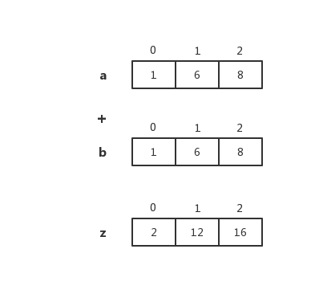
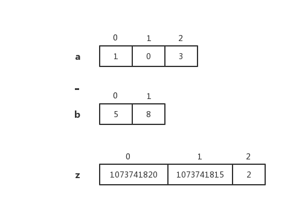

# Python 整数对象

CPython2 的整数对象 有 `PyIntObject` 和 `PyLongObject` 这两种类型，
CPython3 只保留了 `PyLongObject`

在 `源文件：`[Objects/longobject.c](https://github.com/python/cpython/blob/v3.7.0/Objects/longobject.c#L3)
的第三行有这么一句话 `XXX The functional organization of this file is terrible`

可见这个变化不是一蹴而就的，有比较艰辛的过程，大家有兴趣可以去挖掘一下

## PyLongObject

`源文件：`[Include/longobject.h](https://github.com/python/cpython/blob/v3.7.0/Include/longobject.h#L10)

```c
// longobject.h

typedef struct _longobject PyLongObject; /* Revealed in longintrepr.h */
```


`源文件：`[Include/longintrepr.h](https://github.com/python/cpython/blob/v3.7.0/Include/longintrepr.h#L85)

```c
// longintrepr.h
/* Long integer representation.
   The absolute value of a number is equal to
   一个数的绝对值等价于下面的表达式
        SUM(for i=0 through abs(ob_size)-1) ob_digit[i] * 2**(SHIFT*i)

   Negative numbers are represented with ob_size < 0;
   负数表示为 ob_size < 0

   zero is represented by ob_size == 0.
   整数0 用 ob_size == 0表示

   In a normalized number, ob_digit[abs(ob_size)-1] (the most significant
   digit) is never zero.  Also, in all cases, for all valid i,

    在一个规范的数字ob_digit[abs(ob_size)-1]（）永不为0。而且，所有有效的 i 都满足以下要求
        0 <= ob_digit[i] <= MASK.

   The allocation function takes care of allocating extra memory
   so that ob_digit[0] ... ob_digit[abs(ob_size)-1] are actually available.

   CAUTION:  Generic code manipulating subtypes of PyVarObject has to
   aware that ints abuse ob_size's sign bit.

   警告: 通用代码操作 PyVarObject 的子类型必须注意 ob_size的符号滥用问题。
*/

struct _longobject {
    PyObject_VAR_HEAD
    digit ob_digit[1];
};
```

从源码可以看出 PyLongObject 是变长对象


## 类型对象 PyLong_Type

`源文件：`[Objects/longobject.c](https://github.com/python/cpython/blob/v3.7.0/Objects/longobject.c#L5379)

```c
// Objects/longobject.c

PyTypeObject PyLong_Type = {
    PyVarObject_HEAD_INIT(&PyType_Type, 0)
    "int",                                      /* tp_name */
    offsetof(PyLongObject, ob_digit),           /* tp_basicsize */
    sizeof(digit),                              /* tp_itemsize */
    long_dealloc,                               /* tp_dealloc */
    0,                                          /* tp_print */
    0,                                          /* tp_getattr */
    0,                                          /* tp_setattr */
    0,                                          /* tp_reserved */
    long_to_decimal_string,                     /* tp_repr */
    &long_as_number,                            /* tp_as_number */
    0,                                          /* tp_as_sequence */
    0,                                          /* tp_as_mapping */
    (hashfunc)long_hash,                        /* tp_hash */
    0,                                          /* tp_call */
    long_to_decimal_string,                     /* tp_str */
    PyObject_GenericGetAttr,                    /* tp_getattro */
    0,                                          /* tp_setattro */
    0,                                          /* tp_as_buffer */
    Py_TPFLAGS_DEFAULT | Py_TPFLAGS_BASETYPE |
        Py_TPFLAGS_LONG_SUBCLASS,               /* tp_flags */
    long_doc,                                   /* tp_doc */
    0,                                          /* tp_traverse */
    0,                                          /* tp_clear */
    long_richcompare,                           /* tp_richcompare */
    0,                                          /* tp_weaklistoffset */
    0,                                          /* tp_iter */
    0,                                          /* tp_iternext */
    long_methods,                               /* tp_methods */
    0,                                          /* tp_members */
    long_getset,                                /* tp_getset */
    0,                                          /* tp_base */
    0,                                          /* tp_dict */
    0,                                          /* tp_descr_get */
    0,                                          /* tp_descr_set */
    0,                                          /* tp_dictoffset */
    0,                                          /* tp_init */
    0,                                          /* tp_alloc */
    long_new,                                   /* tp_new */
    PyObject_Del,                               /* tp_free */
};
```

## 创建整数对象

从 PyLong_Type 可以看出，创建一个整数对象的入口函数为 long_new

`源文件：`[Objects/clinic/longobject.c.h](https://github.com/python/cpython/blob/v3.7.0/Objects/clinic/longobject.c.h#L0)

```c
// Objects/clinic/longobject.c.h
/*[clinic input]
preserve
[clinic start generated code]*/

static PyObject *
long_new_impl(PyTypeObject *type, PyObject *x, PyObject *obase);

static PyObject *
long_new(PyTypeObject *type, PyObject *args, PyObject *kwargs)
{
    PyObject *return_value = NULL;
    static const char * const _keywords[] = {"", "base", NULL};
    static _PyArg_Parser _parser = {"|OO:int", _keywords, 0};
    PyObject *x = NULL;
    PyObject *obase = NULL;

    if (!_PyArg_ParseTupleAndKeywordsFast(args, kwargs, &_parser,
        &x, &obase)) {
        goto exit;
    }
    return_value = long_new_impl(type, x, obase);

exit:
    return return_value;
}
```

具体实现在 long_new_impl `源文件：`[Objects/longobject.c](https://github.com/python/cpython/blob/v3.7.0/Objects/longobject.c#L4785)

```c
// Objects/longobject.c

/*[clinic input]
@classmethod
int.__new__ as long_new
    x: object(c_default="NULL") = 0
    /
    base as obase: object(c_default="NULL") = 10
[clinic start generated code]*/

static PyObject *
long_new_impl(PyTypeObject *type, PyObject *x, PyObject *obase)
/*[clinic end generated code: output=e47cfe777ab0f24c input=81c98f418af9eb6f]*/
{
    Py_ssize_t base;

    if (type != &PyLong_Type)
        return long_subtype_new(type, x, obase); /* Wimp out */
    if (x == NULL) {
        if (obase != NULL) {
            PyErr_SetString(PyExc_TypeError,
                            "int() missing string argument");
            return NULL;
        }
        return PyLong_FromLong(0L);
    }
    if (obase == NULL)
        return PyNumber_Long(x);

    base = PyNumber_AsSsize_t(obase, NULL);
    if (base == -1 && PyErr_Occurred())
        return NULL;
    if ((base != 0 && base < 2) || base > 36) {
        PyErr_SetString(PyExc_ValueError,
                        "int() base must be >= 2 and <= 36, or 0");
        return NULL;
    }

    if (PyUnicode_Check(x))
        return PyLong_FromUnicodeObject(x, (int)base);
    else if (PyByteArray_Check(x) || PyBytes_Check(x)) {
        char *string;
        if (PyByteArray_Check(x))
            string = PyByteArray_AS_STRING(x);
        else
            string = PyBytes_AS_STRING(x);
        return _PyLong_FromBytes(string, Py_SIZE(x), (int)base);
    }
    else {
        PyErr_SetString(PyExc_TypeError,
                        "int() can't convert non-string with explicit base");
        return NULL;
    }
}
```

从 long_new_impl 函数可以看出有如下几种情况

-  x == NULL 且 obase != NULL 调用 PyLong_FromLong
- obase 为NULL 调用 PyNumber_Long
- x 和 obase 都不为 NULL
    - PyUnicode 调用PyLong_FromUnicodeObject，最终调用PyLong_FromString
    - PyByteArray/PyBytes 调用_PyLong_FromBytes，最终调用PyLong_FromString

## 小整数对象

一些整数在一开始就会被初始化一直留存，当再次使用直接从小整数对象池中获取，不用频繁的申请内存。

默认的小整数范围是 [-5, 257) `源文件：`[Objects/longobject.c](https://github.com/python/cpython/blob/v3.7.0/Objects/longobject.c#L17)

```c
// Objects/longobject.c

#ifndef NSMALLPOSINTS
#define NSMALLPOSINTS           257
#endif
#ifndef NSMALLNEGINTS
#define NSMALLNEGINTS           5
#endif

#if NSMALLNEGINTS + NSMALLPOSINTS > 0
/* Small integers are preallocated in this array so that they
   can be shared.
   The integers that are preallocated are those in the range
   -NSMALLNEGINTS (inclusive) to NSMALLPOSINTS (not inclusive). */
static PyLongObject small_ints[NSMALLNEGINTS + NSMALLPOSINTS];
#ifdef COUNT_ALLOCS
Py_ssize_t quick_int_allocs, quick_neg_int_allocs;
#endif

static PyObject *
get_small_int(sdigit ival)
{
    PyObject *v;
    assert(-NSMALLNEGINTS <= ival && ival < NSMALLPOSINTS);
    v = (PyObject *)&small_ints[ival + NSMALLNEGINTS];
    Py_INCREF(v);
#ifdef COUNT_ALLOCS
    if (ival >= 0)
        quick_int_allocs++;
    else
        quick_neg_int_allocs++;
#endif
    return v;
}
#define CHECK_SMALL_INT(ival) \
    do if (-NSMALLNEGINTS <= ival && ival < NSMALLPOSINTS) { \
        return get_small_int((sdigit)ival); \
    } while(0)
```

宏 **CHECK_SMALL_INT** 会检查传入的数是否在小整数范围内，如果是直接返回。
可以在创建或复制整数对象等函数中找到 **CHECK_SMALL_INT** 的身影，以下只列出了
**PyLong_FromLong**，就不一一列举了

`源文件：`[Objects/longobject.c](https://github.com/python/cpython/blob/v3.7.0/Objects/longobject.c#L239)

```c
// Object/longobject.c

PyObject *
PyLong_FromLong(long ival)
{
    PyLongObject *v;
    unsigned long abs_ival;
    unsigned long t;  /* unsigned so >> doesn't propagate sign bit */
    int ndigits = 0;
    int sign;

    CHECK_SMALL_INT(ival);

    ...
}
```

### 小整数初始化

`源文件：`[Objects/longobject.c](https://github.com/python/cpython/blob/v3.7.0/Objects/longobject.c#L5462)

```c
// Objects/longobject.c

int
_PyLong_Init(void)
{
#if NSMALLNEGINTS + NSMALLPOSINTS > 0
    int ival, size;
    PyLongObject *v = small_ints;

    for (ival = -NSMALLNEGINTS; ival <  NSMALLPOSINTS; ival++, v++) {
        size = (ival < 0) ? -1 : ((ival == 0) ? 0 : 1);
        if (Py_TYPE(v) == &PyLong_Type) {
            /* The element is already initialized, most likely
             * the Python interpreter was initialized before.
             */
            Py_ssize_t refcnt;
            PyObject* op = (PyObject*)v;

            refcnt = Py_REFCNT(op) < 0 ? 0 : Py_REFCNT(op);
            _Py_NewReference(op);
            /* _Py_NewReference sets the ref count to 1 but
             * the ref count might be larger. Set the refcnt
             * to the original refcnt + 1 */
            Py_REFCNT(op) = refcnt + 1;
            assert(Py_SIZE(op) == size);
            assert(v->ob_digit[0] == (digit)abs(ival));
        }
        else {
            (void)PyObject_INIT(v, &PyLong_Type);
        }
        Py_SIZE(v) = size;
        v->ob_digit[0] = (digit)abs(ival);
    }
#endif
    _PyLong_Zero = PyLong_FromLong(0);
    if (_PyLong_Zero == NULL)
        return 0;
    _PyLong_One = PyLong_FromLong(1);
    if (_PyLong_One == NULL)
        return 0;

    /* initialize int_info */
    if (Int_InfoType.tp_name == NULL) {
        if (PyStructSequence_InitType2(&Int_InfoType, &int_info_desc) < 0)
            return 0;
    }

    return 1;
}
```

## 整数的存储结构

`源文件：`[Objects/longobject.c](https://github.com/python/cpython/blob/v3.7.0/Objects/longobject.c#L1581)

在 **long_to_decimal_string_internal**中添加如下代码并重新编译安装
```c
// Objects/longobject.c
static int
long_to_decimal_string_internal(PyObject *aa,
                                PyObject **p_output,
                                _PyUnicodeWriter *writer,
                                _PyBytesWriter *bytes_writer,
                                char **bytes_str)
{
    PyLongObject *scratch, *a;
    PyObject *str = NULL;
    Py_ssize_t size, strlen, size_a, i, j;
    digit *pout, *pin, rem, tenpow;
    int negative;
    int d;
    enum PyUnicode_Kind kind;

    a = (PyLongObject *)aa;

    // 添加打印代码
    printf("ob_size     = %d\n", Py_SIZE(a));
    for (int index = 0; index < Py_SIZE(a); ++index) {
        printf("ob_digit[%d] = %d\n", index, a->ob_digit[index]);
    }

    ...
}
```

编译安装后进入python解释器输入如下代码

```python
num = 9223372043297226753
print(num)

# output
>>> ob_size     = 3
>>> ob_digit[0] = 1
>>> ob_digit[1] = 6
>>> ob_digit[2] = 8
>>> 9223372043297226753
```

如下图所示


注：这里的 30 是由 **PyLong_SHIFT** 决定的，64位系统中，**PyLong_SHIFT** 为30，否则 **PyLong_SHIFT** 为15

## 整数对象的数值操作

可以看到整数对象的数值操作较多，由于篇幅限制无法一一分析，这里只分析整数的部分操作

`源文件：`[Objects/longobject.c](https://github.com/python/cpython/blob/v3.7.0/Objects/longobject.c#L5341)

```c
// Objects/longobject.c

static PyNumberMethods long_as_number = {
    (binaryfunc)long_add,       /*nb_add   加法 */
    (binaryfunc)long_sub,       /*nb_subtract  减法 */
    (binaryfunc)long_mul,       /*nb_multiply    乘法 */
    long_mod,                   /*nb_remainder 取余 */
    long_divmod,                /*nb_divmod */
    long_pow,                   /*nb_power 求幂 */
    (unaryfunc)long_neg,        /*nb_negative */
    (unaryfunc)long_long,       /*tp_positive */
    (unaryfunc)long_abs,        /*tp_absolute 绝对值 */
    (inquiry)long_bool,         /*tp_bool 求bool值 */
    (unaryfunc)long_invert,     /*nb_invert 反转 */
    long_lshift,                /*nb_lshift 逻辑左移 */
    (binaryfunc)long_rshift,    /*nb_rshift 逻辑右移 */
    long_and,                   /*nb_and 与操作 */
    long_xor,                   /*nb_xor 异或 */
    long_or,                    /*nb_or 或操作 */
    long_long,                  /*nb_int*/
    0,                          /*nb_reserved*/
    long_float,                 /*nb_float*/
    0,                          /* nb_inplace_add */
    0,                          /* nb_inplace_subtract */
    0,                          /* nb_inplace_multiply */
    0,                          /* nb_inplace_remainder */
    0,                          /* nb_inplace_power */
    0,                          /* nb_inplace_lshift */
    0,                          /* nb_inplace_rshift */
    0,                          /* nb_inplace_and */
    0,                          /* nb_inplace_xor */
    0,                          /* nb_inplace_or */
    long_div,                   /* nb_floor_divide */
    long_true_divide,           /* nb_true_divide */
    0,                          /* nb_inplace_floor_divide */
    0,                          /* nb_inplace_true_divide */
    long_long,                  /* nb_index */
};
```

### 整数相加

`源文件：`[Objects/longobject.c](https://github.com/python/cpython/blob/v3.7.0/Objects/longobject.c#L3081)

```c
// Objects/longobject.c

static PyObject *
long_add(PyLongObject *a, PyLongObject *b)
{
    PyLongObject *z;

    CHECK_BINOP(a, b);

    if (Py_ABS(Py_SIZE(a)) <= 1 && Py_ABS(Py_SIZE(b)) <= 1) {
        return PyLong_FromLong(MEDIUM_VALUE(a) + MEDIUM_VALUE(b));
    }
    if (Py_SIZE(a) < 0) {
        if (Py_SIZE(b) < 0) {
            z = x_add(a, b);
            if (z != NULL) {
                /* x_add received at least one multiple-digit int,
                   and thus z must be a multiple-digit int.
                   That also means z is not an element of
                   small_ints, so negating it in-place is safe. */
                assert(Py_REFCNT(z) == 1);
                Py_SIZE(z) = -(Py_SIZE(z));
            }
        }
        else
            z = x_sub(b, a);
    }
    else {
        if (Py_SIZE(b) < 0)
            z = x_sub(a, b);
        else
            z = x_add(a, b);
    }
    return (PyObject *)z;
}
```

可以看到整数的加法运算函数long_add根据 a、b的ob_size 又细分为两个函数 (x_add 和 x_sub) 做处理

`源文件：`[Objects/longobject.c](https://github.com/python/cpython/blob/v3.7.0/Objects/longobject.c#L2991)

```c
// Objects/longobject.c

/* Add the absolute values of two integers. */
static PyLongObject *
x_add(PyLongObject *a, PyLongObject *b)
{
    Py_ssize_t size_a = Py_ABS(Py_SIZE(a)), size_b = Py_ABS(Py_SIZE(b));
    PyLongObject *z;
    Py_ssize_t i;
    digit carry = 0;

    /* Ensure a is the larger of the two: */
    // 确保 a 大于 b
    if (size_a < size_b) {
        { PyLongObject *temp = a; a = b; b = temp; }
        { Py_ssize_t size_temp = size_a;
            size_a = size_b;
            size_b = size_temp; }
    }
    z = _PyLong_New(size_a+1);
    if (z == NULL)
        return NULL;
    for (i = 0; i < size_b; ++i) {
        carry += a->ob_digit[i] + b->ob_digit[i];
        z->ob_digit[i] = carry & PyLong_MASK;
        carry >>= PyLong_SHIFT;
    }
    for (; i < size_a; ++i) {
        carry += a->ob_digit[i];
        z->ob_digit[i] = carry & PyLong_MASK;
        carry >>= PyLong_SHIFT;
    }
    z->ob_digit[i] = carry;
    return long_normalize(z);
}
```

加法运算函数 x_add 从 ob_digit 数组的低位开始依次按位相加，carry做进位处理，然后处理a对象的高位数字，最后使用 long_normalize 函数调整 ob_size，确保ob_digit[abs(ob_size)-1]不为零，这与普通四则运算的加法运算相同，只不过进位单元不同而已




`源文件：`[Objects/longobject.c](https://github.com/python/cpython/blob/v3.7.0/Objects/longobject.c#L3025)

```c
// Objects/longobject.c

/* Subtract the absolute values of two integers. */

static PyLongObject *
x_sub(PyLongObject *a, PyLongObject *b)
{
    Py_ssize_t size_a = Py_ABS(Py_SIZE(a)), size_b = Py_ABS(Py_SIZE(b));
    PyLongObject *z;
    Py_ssize_t i;
    int sign = 1;
    digit borrow = 0;

    /* Ensure a is the larger of the two: */
    // 确保 a 大于 b
    if (size_a < size_b) {
        sign = -1;
        { PyLongObject *temp = a; a = b; b = temp; }
        { Py_ssize_t size_temp = size_a;
            size_a = size_b;
            size_b = size_temp; }
    }
    else if (size_a == size_b) {
        /* Find highest digit where a and b differ: */
        // 找到最高位 a 与 b的差异
        i = size_a;
        while (--i >= 0 && a->ob_digit[i] == b->ob_digit[i])
            ;
        if (i < 0)
            return (PyLongObject *)PyLong_FromLong(0);
        if (a->ob_digit[i] < b->ob_digit[i]) {
            sign = -1;
            { PyLongObject *temp = a; a = b; b = temp; }
        }
        size_a = size_b = i+1;
    }
    z = _PyLong_New(size_a);
    if (z == NULL)
        return NULL;
    for (i = 0; i < size_b; ++i) {
        /* The following assumes unsigned arithmetic
           works module 2**N for some N>PyLong_SHIFT. */
        borrow = a->ob_digit[i] - b->ob_digit[i] - borrow;
        z->ob_digit[i] = borrow & PyLong_MASK;
        borrow >>= PyLong_SHIFT;
        borrow &= 1; /* Keep only one sign bit */
    }
    for (; i < size_a; ++i) {
        borrow = a->ob_digit[i] - borrow;
        z->ob_digit[i] = borrow & PyLong_MASK;
        borrow >>= PyLong_SHIFT;
        borrow &= 1; /* Keep only one sign bit */
    }
    assert(borrow == 0);
    if (sign < 0) {
        Py_SIZE(z) = -Py_SIZE(z);
    }
    return long_normalize(z);
}
```

与普通四则运算减法相同，数不够大则向高一位借位，
减法运算函数 x_sub 的示例图如下，注：PyLong_SHIFT为30



### 整数相乘

`源文件：`[Objects/longobject.c](https://github.com/python/cpython/blob/v3.7.0/Objects/longobject.c#L3547)

```c
// Objects/longobject.c
static PyObject *
long_mul(PyLongObject *a, PyLongObject *b)
{
    PyLongObject *z;

    CHECK_BINOP(a, b);

    /* fast path for single-digit multiplication */
    if (Py_ABS(Py_SIZE(a)) <= 1 && Py_ABS(Py_SIZE(b)) <= 1) {
        stwodigits v = (stwodigits)(MEDIUM_VALUE(a)) * MEDIUM_VALUE(b);
        return PyLong_FromLongLong((long long)v);
    }

    z = k_mul(a, b);
    /* Negate if exactly one of the inputs is negative. */
    if (((Py_SIZE(a) ^ Py_SIZE(b)) < 0) && z) {
        _PyLong_Negate(&z);
        if (z == NULL)
            return NULL;
    }
    return (PyObject *)z;
}
```

k_mul函数是一种快速乘法 [源文件](
https://github.com/python/cpython/blob/v3.7.0/Objects/longobject.c#L3268)

>  Karatsuba的算法主要是用于两个大数的乘法，极大提高了运算效率，相较于普通乘法降低了复杂度，并在其中运用了递归的思想。
> 基本的原理和做法是将位数很多的两个大数x和y分成位数较少的数，每个数都是原来x和y位数的一半。
> 这样处理之后，简化为做三次乘法，并附带少量的加法操作和移位操作。

具体可以看wiki [Karatsuba算法](https://www.wikiwand.com/zh-hans/Karatsuba算法)的实现
