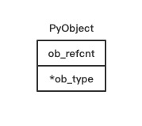
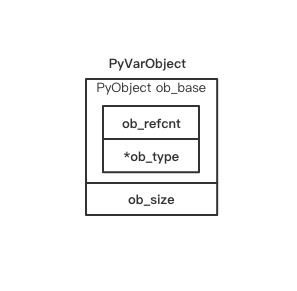
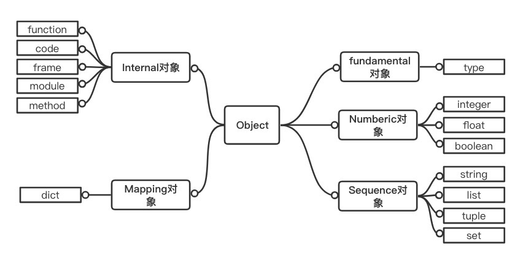

# Python 对象初探

在Python的世界中，一切皆对象。不论是是整数，还是字符串，甚至连类型、函数等都是一种对象。

Python中有一些已经定义好的类型对象，如`int`类型、`str`类型和`dict`类型等，
我们把这些对象称为内建类型对象，这些类型对象通过“实例化”可以创建内建类型对象的实例对象，
如`int`对象、`str`对象和`dict`对象等。

Python还允许我们通过`class A(object)`这样的形式自定义类型对象，我们同样可以对自定义的
类型对象“实例化”从而生成“实例对象”。这些对象之间存在的各种复杂关系构成了“类型系统”和“对象系统”。

Python的类型系统和对象系统非常庞大复杂，我们将分成多篇来解读。本章我们着重于了解对象在Python内部是如何表示的。

## Python 内的对象

对于计算机而言，对象是一个抽象的概念，计算机不懂对象是什么也不能理解字符串、整数是什么，
它所知道的一切都是字节。在计算机中，一个对象的实际的表示就是一片被分配的内存空间，这些内存可能是连续的也可能是离散的，而这片内存所代表的一个整体就是一个对象，它可以存储一系列数据，我们可以对这些数据进行读写等一系列行为。

在Python中，对象就是以C语言中的结构体在堆上申请一块内存为代表的。一个对象一旦创建它的内存大小就不再改变，那些需要容纳变长数据的对象需要在内维护一个指向一块可变大小的内存区域的指针，这样做的好处是可以通过指针非常方便的管理维护对象。

### 对象机制的基石 PyObject

在Python中，所有对象都拥有一些相同的内容，这些内容定义在`PyObject`中，
可以说 `PyObject` 是一切对象的基础，

它包含 一个用于垃圾回收的双向链表，一个引用计数变量 `ob_refcnt` 和 一个类型对象指针`ob_type`

```c
// Include/object.h
#define _PyObject_HEAD_EXTRA            \
    struct _object *_ob_next;           \
    struct _object *_ob_prev;

typedef struct _object {
    _PyObject_HEAD_EXTRA    // 双向链表 垃圾回收 需要用到
    Py_ssize_t ob_refcnt;   // 引用计数
    struct _typeobject *ob_type;    // 指向类型对象的指针，决定了对象的类型
} PyObject;
```



在Python的定义中，对于一个整型对象`longobj`，它的变量`ob_refcnt`与内存管理机制有关，它实现了基于
引用计数的垃圾回收机制。当一个新的对象引用该对象`longobj`时，`longobj`的引用计数增加，而当该引用被删除时候，`longobj`的引用计数减少。
当`longobj`的变量`ob_refcnt`减少为0时，该对象`longobj`从堆上被删除，释放出内存供其他对象使用。

`ob_type`是一个指向`_typeobject`的结构体指针，它对应着Python内部的一类
特殊对象(类型对象)，类型对象用于表示一个对象的类型。

在`PyObject`中定义的内容每一个Python对象都必须有，这些内容在每一个Python
对象占用的内存空间的最开始的字节中。


### 定长对象和变长对象

```c
// Include/object.h
typedef struct _object {
    _PyObject_HEAD_EXTRA
    Py_ssize_t ob_refcnt;
    struct _typeobject *ob_type;
} PyObject;

typedef struct {
    PyObject ob_base;
    Py_ssize_t ob_size; /* Number of items in variable part */
} PyVarObject;
```

变长对象`PyVarObject`与`PyObject`的不同在于多了一个`ob_size`变量，`ob_size`用于保存元素的个数




Python中的整数对象，除了`PyObject_VAR_HEAD`外还有一个额外的东西`ob_digit`,
这个整数对象的值就保存在`ob_digit`中。Python中的字符串对象、list对象、
dict对象等除了`PyObject`以外都有一些属于自己的特殊信息。


```c
// Include/object.h
#define PyObject_VAR_HEAD      PyVarObject ob_base;
```

```c
// Include/longobject.h
typedef struct _longobject PyLongObject; /* Revealed in longintrepr.h */
```

```c
// Include/longintrepr.h
struct _longobject {
    PyObject_VAR_HEAD
    digit ob_digit[1];
};
```

## 类型对象

Python中的对象开始的一些字节中的内容我们是可以明确知道的，双向链表 `ob_refcnt`和`ob_type`; 在创建对象需要知道分配多少内存空间，这个时候
我们需要从对象的`元信息`去找该对象到底该分配多少内存，而这个`元信息`就在
该对象的类型对象中，也就是`ob_type`所指向的对象中。

接下来我们就看看这个类型对象到底长什么样

在 `_typeobject` 的定义中包含许多信息，主要分类以下几类:
- 类型名, tp_name, 主要用于 Python 内部调试用
- 创建该类型对象时分配的空间大小信息，即 `tp_basicsize` 和 `tp_itemsize`
- 与该类型对象相关的操作信息(如 `tp_print` 这样的函数指针)
- 一些对象属性

```c
// Include/object.h
typedef struct _typeobject {
    PyObject_VAR_HEAD
    const char *tp_name; /* For printing, in format "<module>.<name>" */ // 类型名
    Py_ssize_t tp_basicsize, tp_itemsize; /* For allocation */
    // 创建该类型对象分配的内存空间大小

    // 一堆方法定义，函数和指针
    /* Methods to implement standard operations */
    destructor tp_dealloc;
    printfunc tp_print;
    getattrfunc tp_getattr;
    setattrfunc tp_setattr;
    PyAsyncMethods *tp_as_async; /* formerly known as tp_compare (Python 2)
                                    or tp_reserved (Python 3) */
    reprfunc tp_repr;

    /* Method suites for standard classes */
    // 标准类方法集
    PyNumberMethods *tp_as_number;  // 数值对象操作
    PySequenceMethods *tp_as_sequence;  // 序列对象操作
    PyMappingMethods *tp_as_mapping;  // 字典对象操作

    // 更多标准操作
    /* More standard operations (here for binary compatibility) */
    hashfunc tp_hash;
    ternaryfunc tp_call;
    reprfunc tp_str;
    getattrofunc tp_getattro;
    setattrofunc tp_setattro;

    ......

} PyTypeObject;
```

### 对象的创建

一般来说，Python会有两种方式创建对象
- 通过 Python C API 来创建
- 通过类型对象创建

#### 范型API 或称为 AOL (Abstract Object Layer)

这类API通常形如`PyObject_XXX`这样的形式。可以应用在任何Python对象上，如`PyObject_Print`

#### 与类型相关的API 或称为 COL (Concrete Object Layer)

这类API 通常只能作用于某一种类型的对象上，对于每一种内建对象
Python都提供了这样一组API。例如整数对象，我们可以利用如下的API创建
```c
PyObject *longObj = PyLong_FromLong(10);
```


### 对象的行为

在 `PyTypeObject` 中定义了大量的函数指针。这些函数指针可以视为类型对象中
所定义的操作，这些操作直接决定着一个对象在运行时所表现出的行为。

比如 `PyTypeObject` 中的 `tp_hash` 指明了该类型对象如何生成其`hash`值。
在之前的`PyTypeObject`代码中，我们可以看到非常重要的三组操作族
`PyNumberMethods *tp_as_number`、`PySequenceMethods *tp_as_sequence`、`PyMappingMethods *tp_as_mapping`，

```c
typedef PyObject * (*binaryfunc)(PyObject *, PyObject *);

typedef struct {
    binaryfunc nb_matrix_multiply;
    binaryfunc nb_inplace_matrix_multiply;

    ......
} PyNumberMethods;
```

在`PyNumberMethods`定义了一个数值对象该支持的操作。一个数值对象如 整数对象，那么它的类型对象 `PyLong_Type`中,`tp_as_number.nb_add`
就指定了它进行加法操作时的具体行为。`PyMappingMethods`与`PySequenceMethods`与此相同。

在以下代码中可以看出`PyLong_Type`中的`tp_as_number`项指向的是`long_as_number`

```c
// Objects/longobject.c
static PyNumberMethods long_as_number = {
    (binaryfunc)long_add,       /*nb_add*/
    (binaryfunc)long_sub,       /*nb_subtract*/
    (binaryfunc)long_mul,       /*nb_multiply*/

    ......
};

PyTypeObject PyLong_Type = {
    PyVarObject_HEAD_INIT(&PyType_Type, 0)
    "int",                                      /* tp_name */
    offsetof(PyLongObject, ob_digit),           /* tp_basicsize */
    sizeof(digit),                              /* tp_itemsize */
    long_dealloc,                               /* tp_dealloc */
    0,                                          /* tp_print */
    0,                                          /* tp_getattr */
    0,                                          /* tp_setattr */
    0,                                          /* tp_reserved */
    long_to_decimal_string,                     /* tp_repr */
    &long_as_number,                            /* tp_as_number */
    0,                                          /* tp_as_sequence */
    0,                                          /* tp_as_mapping */

    ......
};

```

### 类型的类型

在 `PyTypeObjet` 定义开始有 `PyOject_VAR_HEAD`，这意味着 Python 中的类型实际上也是一个对象。在Python中一切东西都是对象，那么类型对象的类型是什么呢？
对于其他对象，可以通过与其关联的对象确定其类型，那么通过什么来确定一个对象是类型对象呢？
答案就是 `PyType_Type`

```c
// Objects/typeobject.c
PyTypeObject PyType_Type = {
    PyVarObject_HEAD_INIT(&PyType_Type, 0)
    "type",                                     /* tp_name */
    sizeof(PyHeapTypeObject),                   /* tp_basicsize */
    sizeof(PyMemberDef),                        /* tp_itemsize */

    ......
};
```

`PyType_Type` 在Python的类型机制中至关重要，所有用户自定义 `class` 所
对应的 `PyTypeObject` 对象都是通过 `PyType_Type`创建的


接下来我们看 `PyLong_Type` 是怎么与 `PyType_Type` 建立联系的。
前面提到，在Python中，每一个对象都将自己的引用计数、类型信息保存在开始的部分中。
为了方便对这部分内存初始化，Python中提供了几个有用的宏:

```c
// Include/object.h
#ifdef Py_TRACE_REFS
    #define _PyObject_EXTRA_INIT 0, 0,
#else
    #define _PyObject_EXTRA_INIT
#endif

#define PyObject_HEAD_INIT(type)        \
    { _PyObject_EXTRA_INIT              \
    1, type },
```

再回顾下 `PyObject`和`PyVarObject`的定义，初始化动作就一目了然了。
实际上，这些宏在各种内建类型对象的初始化中被大量使用。
以`PyLong_Type`为例，可以更清晰的看到一般的类型对象和`PyType_type`之间的关系

```c
// Include/longobject.c

PyTypeObject PyLong_Type = {
    PyVarObject_HEAD_INIT(&PyType_Type, 0)
    "int",                                      /* tp_name */
    offsetof(PyLongObject, ob_digit),           /* tp_basicsize */
    sizeof(digit),                              /* tp_itemsize */

    ......
};
```

下图是对象运行时的图像表现


## Python 对象的多态性

Python创建一个对象比如 PyLongObject 时，会分配内存进行初始化，然后
Python内部会用 `PyObject*` 变量来维护这个对象，其他对象也与此类似，
所以在 Python 内部各个函数之间传递的都是一种范型指针 `PyObject*`
我们不知道这个指针所指的对象时什么类型，只能通过所指对象的 ob_type 域
动态进行判断，而Python正是通过 `ob_type` 实现了多态机制

考虑以下的 Print 函数

```c
void Print(PyObject* object)
{
    object->ob_type->tp_print(object);
}
```

如果传递给 Print 函数的指针时一个 `PyLongObject*`，那么它会调用 PyLongOjbect 对象对应的类型对象中定义的 输出操作

如果指针是一个 `PyUnicodeObject*`，那么就会调用 PyUnicodeObject 对象对应的类型对象中定义的输出操作


## 引用计数

> Python 通过引用计数来管理维护对象在内存中的存在与否
> Python 中的每个东西都有一个对象， 都有`ob_refcnt` 变量
> 这个变量维护对象的引用计数，从而最终决定该对象的创建与销毁

在Python中，主要通过 `Py_INCREF(op)`与`Py_DECREF(op)` 这两个宏
来增加和减少对一个对象的引用计数。当一个对象的引用计数减少到0之后，
`Py_DECREF`将调用该对象的`tp_dealloc`来释放对象所占用的内存和系统资源

```c
// Include/object.h
#define _Py_NewReference(op) (                          \
    _Py_INC_TPALLOCS(op) _Py_COUNT_ALLOCS_COMMA         \
    _Py_INC_REFTOTAL  _Py_REF_DEBUG_COMMA               \
    Py_REFCNT(op) = 1)

#define Py_INCREF(op) (                         \
    _Py_INC_REFTOTAL  _Py_REF_DEBUG_COMMA       \
    ((PyObject *)(op))->ob_refcnt++)

#define Py_DECREF(op)                                   \
    do {                                                \
        PyObject *_py_decref_tmp = (PyObject *)(op);    \
        if (_Py_DEC_REFTOTAL  _Py_REF_DEBUG_COMMA       \
        --(_py_decref_tmp)->ob_refcnt != 0)             \
            _Py_CHECK_REFCNT(_py_decref_tmp)            \
        else                                            \
            _Py_Dealloc(_py_decref_tmp);                \
    } while (0)
```

一个对象引用计数减为0时，该对象的`析构函数`被调用，但调用`析构函数`并不意味着最终一定会调用 `free` 释放内存空间。
因为频繁的申请、释放内存会大大降低Python的执行效率。
因此Python中大量采用了内存对象池的技术，使得对象释放的空间归还给内存池而不是直接`free`，后续使用可先从对象池中获取


## Python 对象的分类

- Fundamental 对象: 类型对象
- Numeric 对象: 数值对象
- Sequence 对象: 容纳其他对象的序列集合对象
- Mapping 对象: 类似 C++中的 map 的关联对象
- Internal 对象: Python 虚拟机在运行时内部使用的对象


